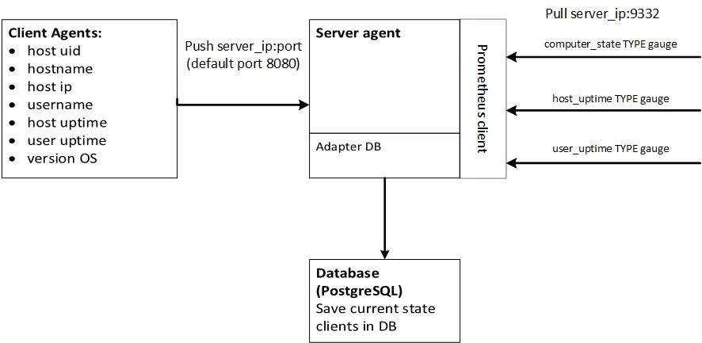

# Мониторинговая система использования ПК и активности пользователей

## Состав системы

  * Клиенсткий агент (пока только Windows, windows_agent/ClientAgent.py)
  * Серверный агент
  * Адаптер БД
  * Адаптер Prometheus

## Архитектура проекта

